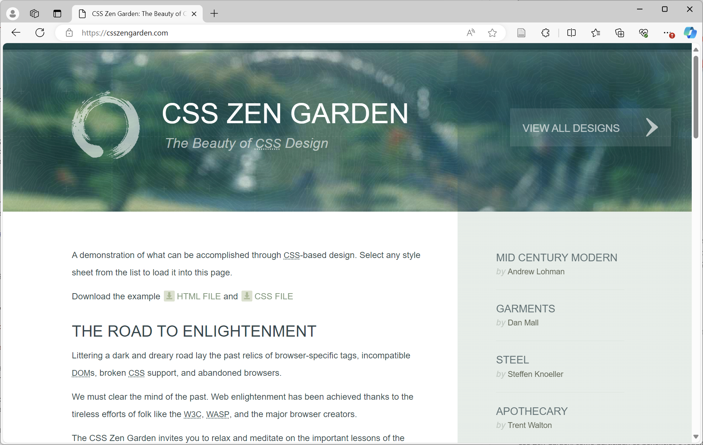
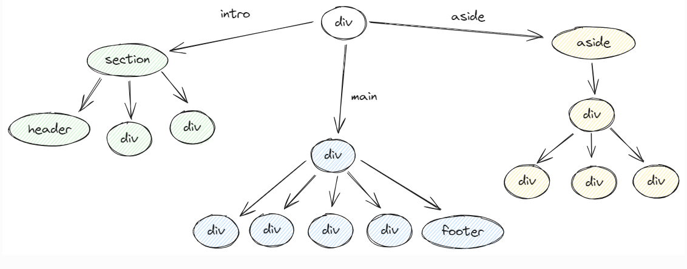

# Exercícios: CSS Zen Garden

* Desenvolvimento de Aplicações Web
* COLTEC/UFMG
* Professor: João Eduardo Montandon

## O que é?

O CSS Zen Garden é um projeto criado por Dave Shea em 2003 que demonstra a capacidade da linguagem CSS em transformar a aparência de uma página web sem modificar seu conteúdo. O objetivo do projeto é mostrar como o CSS pode ser usado de forma criativa e eficaz para estilizar dar identidade a páginas web, sem a necessidade de alterações no seu código HTML.

O conceito por trás do CSS Zen Garden é simples: uma única página HTML é fornecida como base para todos os participantes do projeto. **O desafio é criar diferentes designs, estilos e layouts para essa página usando apenas CSS**. O conteúdo da página permanece o mesmo, incluindo o texto e as imagens, mas cada designer tem a liberdade de personalizar totalmente a aparência da página.

Os designs apresentados no CSS Zen Garden variam de simples e minimalistas a elaborados e criativos, e muitos designers talentosos de todo o mundo contribuíram ao longo dos anos. O site oficial do projeto[^1] serve como uma galeria virtual de designs, permitindo que os visitantes comparem e apreciem as diferentes abordagens de design utilizando apenas CSS.

### Estrutura

Do ponto de vista de estrutura, a página do CSS Zen Garden pode ser dividida em três grandes containers

#### Intro

Este container contém três componentes e estrutura as **informações introdutórias** do site. Nele você irá encontrar o título, o resumo, e o preâmbulo descritos na página.

#### Main

Esta é a maior seção da página, e descreve detalhadamente o **propósito** da página. Essa seção possui containers que descrevem em detalhes sobre o que o CSS Zen Garden, como participar, os benefícios e requisitos para participar do desafio. Além disso, um footer ao final da seção apresenta os principais links para participar do projeto.

#### Aside

Este container apresenta os links de **navegação para outros recursos** do projeto. Nele contém uma seção para últimos designs, uma seção para designs mais antigos, e uma última seção para outros recursos da página (CSS, recursos, FAQ, etc).

## Exercícios

**O objetivo dos exercícios desta atividade é criar seu próprio layout CSS!**
Para isso você tem a disposição dois arquivos:

* `index.html`, contém o código HTML da página CSS Zen Garden
* `style.css`, contém o código CSS que será utilizado para estilizar a página `index.html`

Em suas tarefas você deverá alterar o arquivo `style.css` com os estilos descritos nos exercícios. 

### T1: Paleta de Cores

Vamos iniciar a construção da nossa versão do CSS Zen Garden!

1. Defina uma paleta de cores que você irá trabalhar.
	- Essa paleta deverá ter pelo menos três cores: uma cor de fundo, uma cor para fonte, e uma cor de destaque.
	- **Dica:** Pense primeiro no tema que você deseja utilizar. Explore as versões já submetidas ao projeto.
	- Utilize ferramentas como o [Adobe Kuler](https://color.adobe.com/) para auxiliar na criação da paleta após escolha do tema.
2. Aplique a cor principal no texto da página, e a cor secundária como cor de fundo.

### T2: Estrutura Textual

Nesta atividade iremos personalizar o texto presente na página [CSS Zen Garden: The Beauty of CSS Design](http://www.csszengarden.com/).

1. **Aspectos gerais.** Aplique os seguintes estilos a estrutura geral da página.
	1. Defina um tamanho fixo para a página inteira
	2. Defina uma fonte do tipo `sans-serif` para a página inteira
	3. Indente os parágrafos em `1em`
2. **Títulos.** Alinhe todos os títulos para o centro ou a direita.
	1. Defina o tamanho do `h1` em `1.8rem`
	2. Defina o tamanho do `h2` em `1.4rem`
	3. Defina o tamanho do `h3` em `1.2rem`
3. **Seções de resumo e principal.** Localize os elementos que representam a seção de resumo e principal da página, e aplique nelas:
	1. Alinhamento a direita ou centralizado para a seção de resumo.
	2. Espaçamento entre as linhas de `1.5` para os parágrafos da seção principal.
4. **Abreviaturas.** Customize todos as abreviaturas para que a fonte seja carregada em `small-caps`.

### T3: Box Model

1. Vamos definir algumas diretivas gerais para nossa página.  
    - Defina a largura geral da página em 80%, limitado a no máximo `1280px` de largura. Centralize a página na tela.  
    - Defina a altura da seção de introdução em `550px`  
    - Remova o container `#design-archives` da renderização da página
2. Agora vamos incrementar o cabeçalho da página.  
    - Inverta a cor do cabeçalho aplicando o fundo escuro e a fonte clara.  
    - Coloque título e subtítulo lado-a-lado, mas mantendo espaçamento entre eles e o restante da página.  
    - Adicione um espaçamento lateral de 1em para o título principal.
3. É hora de incrementar os menus!  
    - Remova os bullets dos itens de menu presentes no painel lateral.  
    - Aumente o espaçamento entre os itens do menu para 1em, pelo menos.  
    - Centralize os itens presentes em cada menu.
4. Por fim, vamos aplicar uma inversão de cores no rodapé para ele ganhar um contraste em relação ao restante da página.  
    - Adicione 4% de espaçamento externo no rodapé.  
    - Transforme cada link do rodapé em uma caixa colocando borda sólida de 2px, e espaçamento interno de 0.5em.

### T4: Posicionamento

O foco dessa atividade será reposicionar os elementos da nossa página!

1. Defina o elemento `.page-wrapper` como referência para posicionamento.
2. Faça com que o painel `.explanation` ocupe 60% da largura disponível, mas crie um espaçamento a direita de 35% utilizando `margin`.  
    - Adicione uma borda à direita do painel de 1px, com a cor `#1f295c`  
    - Adicione um espaçamento interno de 2% no lado direito do painel.
3. Agora mova o menu de designs para a direita da página, ocupando o espaço em branco deixado pelo elemento `.explanation`.  
    - Faça-o iniciar na parte superior da página, após a parte de introdução (por exemplo, aplicando `top: 560px`).  
    - Faça-o iniciar após o elemento `.explanation` (por exemplo, aplicando `left: 62%`).  
    - Adicione um espaçamento interno horizontal de 2% no menu para centralizá-lo.

### T5: Seletores de Pseudo-Classe

1. Customize a aparência dos links da seguinte forma:
	- Por padrão, devem ter a cor de destaque e estarem em negrito.
	- Se sobrepostos, devem ter sua cor alterada para uma tonalidade mais clara/escura.
	- Os links visitados não devem ficar mais em negrito.
2. Vamos dar um destaque a primeira letra do primeiro parágrafo da seção principal. Você deverá customizá-lo para que:
	- Tenha tamanho de fonte 3 vezes maior que o padrão.
	- Seja de uma fonte diferente da escolhida para o site.
	- Fique flutuando a esquerda.
	- *OBS: você precisará aplicar mais de um pseudo-seletor para realizar essa estilização. Fique atento!*
3. Utilize bordas para criar um separador entre os itens presentes no menu de design.
	- Aplique uma borda superior no topo de todos os itens de menu.
	- Aplique uma borda inferior apenas no último item da lista.

### T6: Flexbox

1. Aplique o flexbox no rodapé da seção principal, e posicione os links de forma que fiquem centralizados e com espaçamento entre eles.  
    - Defina um mesmo tamanho para os links.  
    - Não se esqueça de tratar o caso de quebra de linha.
2. Configure um layout de flexbox para a seção de benefícios da seguinte forma:  
    - O texto deve ficar à esquerda, e o título à direita.  
    - O título deve ficar centralizado verticalmente.  
    - O texto deve ocupar aproximadamente 70% da largura, e o título 30%.
3. Configure um layout de flexbox para a seção de participação da seguinte forma:  
    - Cada item deve ocupar 50% do espaço disponível.  
    - O título deverá ficar centralizado verticalmente.
4. Inclua uma linha no topo e embaixo das seções de benefícios e participação, utilizando a propriedade `border-bottom` e `border-top` respectivamente.  
    - Remova a ocorrência de borda duplicada entre as duas seções

[^1]: [CSS Zen Garden: The Beauty of CSS Design](https://www.csszengarden.com/)
